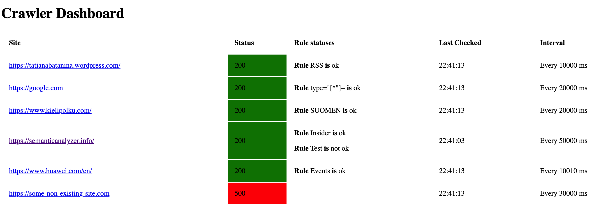

System description
===
The crawler system allows for configurable periodic check of URLs for two requirements:
1. URL must respond with status code 200
2. URL must match configured rules

The crawler is implemented as a dashboard with the UI. Backend is Python 3.6 and frontend is html + ajax.

The rules and intervals for periodic check are configured on URL level in the file conf/urls_rules.tab.
It is TAB separated file with the following fields:

URL	check interval in milliseconds	string / regual expression to look for

There could be multiple rules for a given URL: separate them with TAB

At each check log file is appended, it is located in logs/status_checks.log

The logic is implemented using dashboard approach with Flask.

How to start
===

In order to start the system, navigate to the terminal under the root of the crawler project:

1. export FLASK_APP=src/crawler.py
2. python -m flask run
3. open http://127.0.0.1:5000/check in browser

You should see a dashboard like this:

